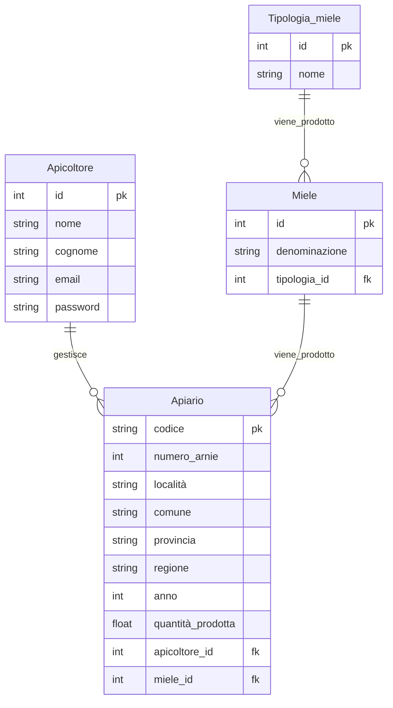

```mermaid

erDiagram
    Apicoltore ||--o{ Apiario : gestisce
    Miele ||--o{ Apiario : viene_prodotto
    Tipologia_miele ||--o{ Miele : viene_prodotto

    Apicoltore {
        int id pk
        string nome
        string cognome
        string email
        string password
    }

    Apiario {
        string codice pk
        int numero_arnie
        string località
        string comune
        string provincia
        string regione
        int anno
        float quantità_prodotta
        int apicoltore_id fk
        int miele_id fk
    }
    Miele {
        int id pk
        string denominazione
        int tipologia_id fk
    }
    Tipologia_miele {
        int id pk
        string nome
    }
```