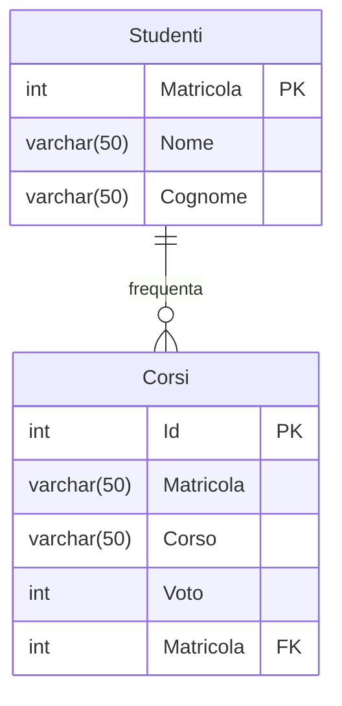

```mermaid

erDiagram
    Studenti {
        int Matricola PK
        varchar(50) Nome
        varchar(50) Cognome
    }

    Corsi {
        int Id PK
        varchar(50) Matricola
        varchar(50) Corso
        int Voto
        int Matricola FK
    }

    %% Relationships
    Studenti ||--o{ Corsi : "frequenta"
```