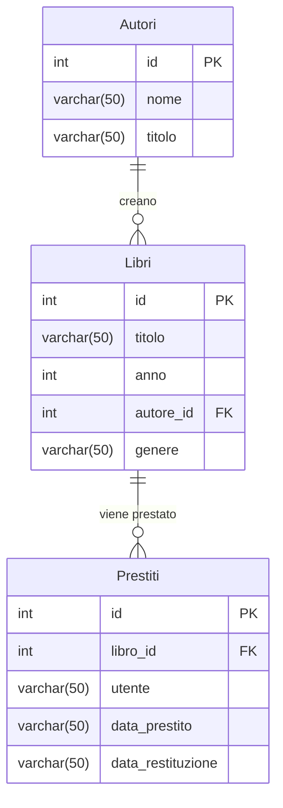

```mermaid

erDiagram
    Autori {
        int id PK
        varchar(50) nome
        varchar(50) titolo
    }
    Libri {
        int id PK
        varchar(50) titolo
        int anno
        int autore_id FK
        varchar(50) genere
    }
    Prestiti {
        int id PK
        int libro_id FK
        varchar(50) utente
        varchar(50) data_prestito 
        varchar(50) data_restituzione
    }
    Autori ||--o{ Libri : "creano"
    Libri ||--o{ Prestiti : "viene prestato"
```