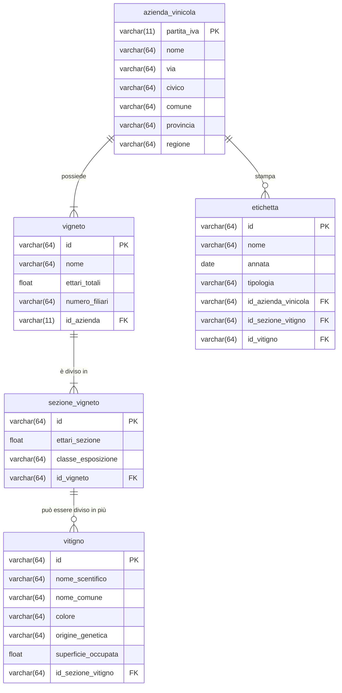

```mermaid
erDiagram

    azienda_vinicola {
        varchar(11) partita_iva PK
        varchar(64) nome
        varchar(64) via
        varchar(64) civico
        varchar(64) comune
        varchar(64) provincia
        varchar(64) regione
    }

    vigneto {
        varchar(64) id PK
        varchar(64) nome
        float ettari_totali
        varchar(64) numero_filiari
        varchar(11) id_azienda FK
    }

    sezione_vigneto {
        varchar(64) id PK
        float ettari_sezione
        varchar(64) classe_esposizione
        varchar(64) id_vigneto FK
    }

    vitigno {
        varchar(64) id PK
        varchar(64) nome_scentifico
        varchar(64) nome_comune
        varchar(64) colore
        varchar(64) origine_genetica
        float superficie_occupata
        varchar(64) id_sezione_vitigno FK
    }

    etichetta {
        varchar(64) id PK
        varchar(64) nome
        date annata
        varchar(64) tipologia
        varchar(64) id_azienda_vinicola FK
        varchar(64) id_sezione_vitigno FK
        varchar(64) id_vitigno FK
    }

    azienda_vinicola ||--|{ vigneto : "possiede"

    vigneto ||--|{ sezione_vigneto : "è diviso in"

    sezione_vigneto ||--o{ vitigno : "può essere diviso in più"

    azienda_vinicola ||--o{ etichetta : "stampa"
```