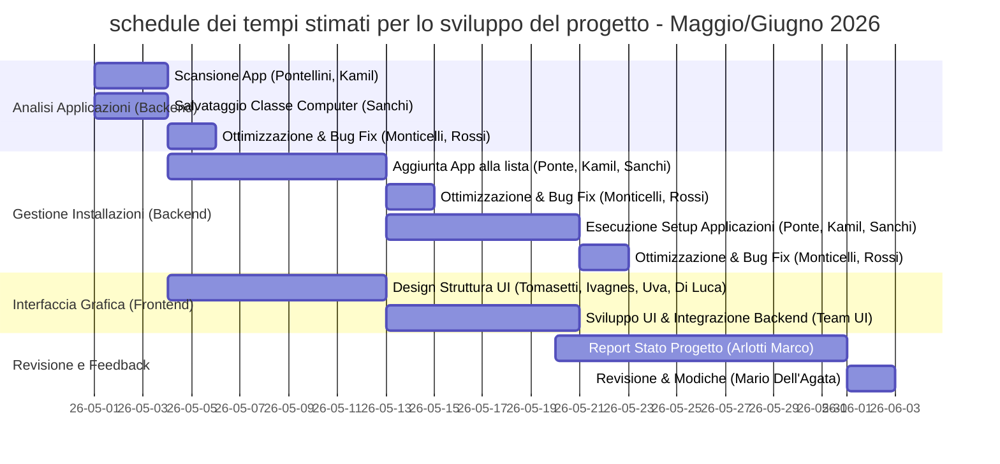

# relazione del prgetto basecamp: Arlo's AUTO-APP-SETUP™
Arlo's AUTO-APP-SETUP™ permette di installare molti programmi in una sola volta su molti pc dei vari laboratori nelle varie sedi dell'isisgobetti.

Tramite basecamp si ha creato la home del progetto, inserend la descrizione, i dipendenti, i THREAD e l'analisi dei requisiti del progetto.

Tutti gli utenti sono liberi di consultare queste informazioni per dare feedback sul porgetto e portandolo al termine.

## Documenti e file
Nella sezione documenti e file, si trova pubblicata per tutti l'analisi dei requisiti del progetto.

## THREAD
Tramite i THREAD si ha potuto trovare errori nella pianificazione originale del progetto, difatti e' stata organizzata una schedule dei tempi che impieghera il progetto.

## gantt del progetto

## Analisi dei costi

1. **Analisi Applicazioni (Backend)** ***5750€***
    - Scansione App (Pontellini, Kamil)
    - Salvataggio Classe Computer (Sanchi)
    - Ottimizzazione & Bug Fix (Monticelli, Rossi)

---

2. **Gestione Installazioni (Backend)** ***6750€***
    - Aggiunta App alla lista (Ponte, Kamil, Sanchi) 
    - Ottimizzazione & Bug Fix (Monticelli, Rossi)
    - Esecuzione Setup Applicazioni (Ponte, Kamil, Sanchi)
    - Ottimizzazione & Bug Fix (Monticelli, Rossi)

---

3. **Interfaccia Grafica (Frontend)** ***5750€***
    - Design Struttura UI (Tomasetti, Ivagnes, Uva, Di Luca)
    - Sviluppo UI & Integrazione Backend (Team UI)

---

4. **Revisione e Feedback** ***750€***
    - Report Stato Progetto (Arlotti Marco)
    - Revisione & Modiche (Mario Dell'Agata)

---

Prezzo di vendita del prodotto: ***19.000€***

---
