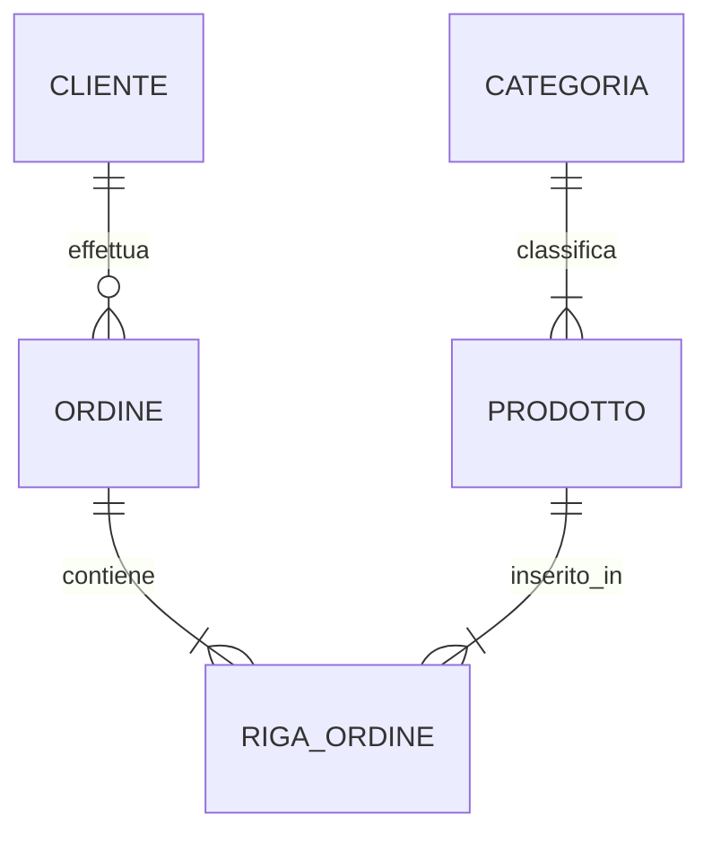

Sviluppare un diagramma **Entity-Relationship (ER)** è un passaggio fondamentale per progettare un database solido. È il ponte tra la realtà (il dominio del problema) e il codice (lo schema SQL).

Ecco una guida strutturata per creare diagrammi ER efficaci, pronta per il tuo file Markdown.

---

## 1. I Componenti Base

Prima di definire le relazioni, dobbiamo identificare gli "attori" in gioco:

* **Entità (Rettangoli):** Oggetti del mondo reale con un'esistenza autonoma (es. *Studente*, *Prodotto*).
* **Attributi (Ovali):** Proprietà dell'entità (es. *Nome*, *Data di Nascita*).
* **Chiave Primaria (PK):** L'attributo che identifica univocamente un'istanza (solitamente sottolineato).

* **Relazioni (Rombi):** I legami logici tra le entità.

---

## 2. Tipi di Relazioni (Cardinalità)

La cardinalità definisce quante istanze di un'entità possono essere collegate a istanze dell'altra.

### A. Uno a Uno (1:1)

Un'istanza di A è collegata esattamente a un'istanza di B.

* **Esempio:** Ogni *Cittadino* ha una sola *Carta d'Identità* (e viceversa).
* **Modellazione:** Si usa spesso quando si vuole separare dati per motivi di sicurezza o performance.

### B. Uno a Molti (1:N)

Un'istanza di A può essere collegata a molte istanze di B, ma B è collegata a una sola A.

* **Esempio:** Un *Dipartimento* ha molti *Impiegati*, ma un *Impiegato* lavora in un solo *Dipartimento*.
* **Modellazione:** È il tipo di relazione più comune.

### C. Molti a Molti (N:M)

Molte istanze di A possono essere collegate a molte istanze di B.

* **Esempio:** Uno *Studente* segue molti *Corsi*, e un *Corso* è seguito da molti *Studenti*.
* **Nota tecnica:** In fase di implementazione (SQL), questa relazione genera sempre una **tabella di join** intermedia.

---

## 3. Casi Particolari e Concetti Avanzati

### Relazione Ricorsiva (Auto-relazione)

Un'entità è legata a se stessa.

* **Esempio:** L'entità *Impiegato*. Un impiegato può essere il "Manager" di altri impiegati. Entrambi sono istanze della stessa tabella.

### Entità Debole

Un'entità che non può essere identificata univocamente solo dai propri attributi, ma dipende da un'entità "forte".

* **Esempio:** Le *Stanze* di un *Hotel*. La "Stanza 101" non è univoca nel mondo; esiste solo in relazione al "Hotel Splendid".
* **Rappresentazione:** Rettangolo con doppio bordo.

### Gerarchie (ISA - "is a")

Rappresenta concetti di ereditarietà (Generalizzazione/Specializzazione).

* **Esempio:** Un *Veicolo* può essere una *Auto* o un *Camion*.
* **Attributi:** Le sottoclassi ereditano gli attributi della superclasse ma ne aggiungono di specifici (es. *Capacità di carico* per il camion).

---

## 4. Esempio Pratico: Sistema E-commerce

Proviamo a visualizzare come queste relazioni interagiscono in un sistema reale:

1. **Utente - Carrello (1:1):** Ogni utente ha un carrello attivo.
2. **Categoria - Prodotto (1:N):** Una categoria contiene molti prodotti, un prodotto appartiene a una sola categoria.
3. **Prodotto - Ordine (N:M):** Un ordine contiene più prodotti, e un prodotto può apparire in più ordini (nel tempo).

| Entità A | Relazione | Entità B | Cardinalità |
| --- | --- | --- | --- |
| Cliente | Effettua | Ordine | 1:N |
| Ordine | Contiene | Prodotto | N:M |
| Prodotto | Fornito da | Fornitore | N:1 |

---

## 5. Consigli per il tuo file Markdown

Per inserire diagrammi direttamente in Markdown senza usare immagini esterne, ti consiglio di usare la sintassi **Mermaid**, supportata da GitHub, Obsidian e VS Code:

**Workflow suggerito:**

1. **Identifica i sostantivi** nel testo del problema (diventeranno Entità).
2. **Identifica i verbi** (diventeranno Relazioni).
3. **Definisci i vincoli** (Quanti? Tutti? Solo alcuni?) per stabilire la cardinalità.
4. **Aggiungi gli attributi** partendo dalle chiavi primarie.