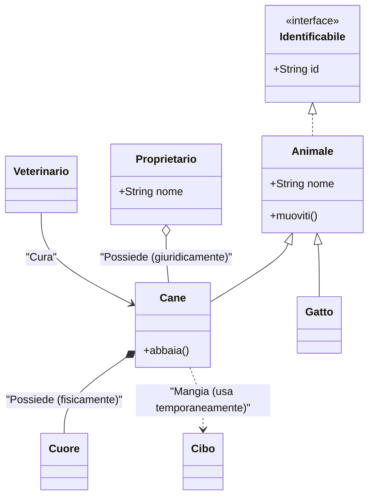
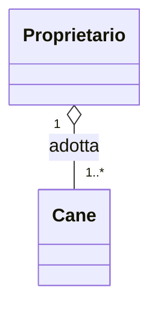

Per scrivere diagrammi UML all'interno di file Markdown (`.md`), lo standard de facto è **Mermaid.js**. Molte piattaforme (GitHub, GitLab, Obsidian, VS Code con estensioni) lo supportano nativamente.

Il trucco è racchiudere il codice all'interno di un blocco di codice con il linguaggio specificato come `mermaid`.

---

## 1. La Sintassi delle Relazioni

In un diagramma delle classi Mermaid, le relazioni si definiscono con una sintassi a "frecce" che indica visivamente il legame. Ecco i simboli principali:

| Tipo di Relazione | Sintassi | Descrizione |
| --- | --- | --- |
| **Ereditarietà** | `-- | >` |
| **Composizione** | `*--` | Una parte forte: se il contenitore muore, muore anche la parte. |
| **Aggregazione** | `o--` | Una parte debole: l'oggetto contenuto può vivere da solo. |
| **Associazione** | `-->` | Una connessione semplice tra due classi. |
| **Dipendenza** | `..>` | Una classe usa l'altra (es. come parametro di un metodo). |
| **Realizzazione** | `.. | >` |

---

## 2. Esempio Completo: Il Sistema di una Clinica Veterinaria

Ecco un esempio che racchiude ogni caso possibile, pronto per essere incollato nel tuo file `.md`.

---

## 3. Spiegazione dei Casi

### Ereditarietà (`--|>`)

Rappresenta la relazione "Is-A". `Cane` eredita da `Animale`. La freccia punta verso la classe genitore (più generica).

### Realizzazione (`..|>`)

Si usa quando una classe implementa un'interfaccia o un contratto. La linea è tratteggiata per distinguere l'implementazione dall'eredità pura.

### Composizione (`*--`)

Rappresenta un legame di possesso forte. Se eliminiamo l'oggetto `Cane`, l'oggetto `Cuore` non ha senso di esistere da solo. Il rombo è **pieno**.

### Aggregazione (`o--`)

Rappresenta un legame "parte-di" ma debole. Un `Proprietario` ha un `Cane`, ma se il proprietario sparisce, il cane continua a esistere (magari viene adottato). Il rombo è **vuoto**.

### Associazione (`-->`)

È la relazione più comune. Indica semplicemente che una classe comunica con un'altra. Puoi aggiungere una freccia per indicare la direzione della visibilità.

### Dipendenza (`..>`)

Indica che una classe dipende da un'altra per un breve momento (es. `Cane` usa `Cibo` dentro un metodo, ma non lo "possiede" come attributo a lungo termine).

---

## 4. Bonus: Molteplicità e Annotazioni

Puoi aggiungere dettagli sulle relazioni scrivendo il testo tra virgolette o aggiungendo i numeri di molteplicità:

* `"1"` : Esattamente uno.
* `"0..*"` : Da zero a molti.
* `"1..*"` : Almeno uno.

Ti è chiaro come implementarlo nel tuo progetto o hai bisogno di vedere come gestire i metodi e gli attributi nel dettaglio?